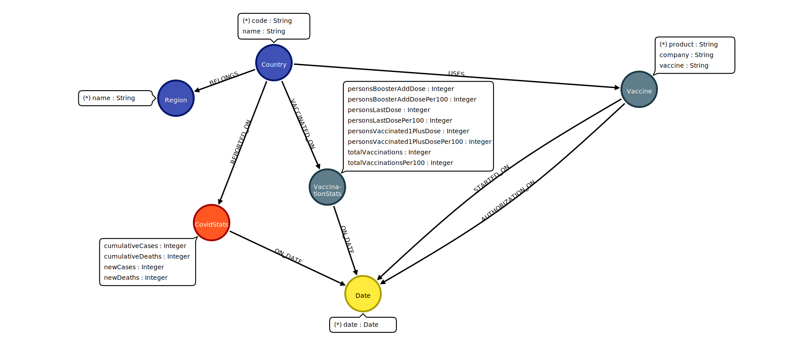

# **Covid 19 neo4J API**

<div align="center">
<a href="#">  
  
</a>
</div><br>

This project provides an API that interacts with a Neo4J database containing COVID-19 data. Follow the steps below to configure the environment, start the API, and run the Neo4J database using Docker Compose.

## Requirements

- Docker
- Docker Compose
- Go (for running the API)
- Postman (for testing the API endpoints)

## Setup Instructions

### Step 1: Configure the `.env` File

Before running the API, configure the `.env` file for your environment settings. This file contains essential configuration variables such as database connection details.

1. Copy the `.env.example` file to `.env`:

   ```bash
   cp .env.example .env
## Strategy: ETL Process for Data

This project uses an ETL (Extract, Transform, Load) strategy to handle the data flow and store it in the Neo4J database. The ETL process works as follows:

- **Extract**: Data is pulled from reliable sources such as Kaggle or other external APIs, which provide detailed COVID-19 data.
- **Transform**: The raw data is cleaned and transformed into a structured format that is ready for analysis. This step includes filtering, removing duplicates, and handling missing values. The data is also transformed into a graph structure suitable for Neo4J.
- **Load**: After transformation, the structured data is loaded into the Neo4J graph database, which allows for efficient querying and analysis of the relationships between different COVID-19 data points (such as countries, regions, and more).


# **Populate the Neo4J Database with CSV Files**

To populate the Neo4J database with the COVID-19 data, you need to upload the CSV files located in the `docs/data` folder into the database. Follow these steps:

### Step 1: Upload CSV Files in the `docs/data` Folder to endpoint Process CSV
Ensure that the relevant CSV files (e.g., `vaccination-data.csv`, `vaccine.csv`, `covid-global.csv`, `covid.csv`) are stored in the `docs/data` folder in the project directory.

### Step 2: Prepare Your API Request

Use the following endpoint to upload the CSV files. This will trigger the process of loading the data into the Neo4J database.

#### **End-point: Process CSV**
- **Method**: `POST`
- **URL**: `{{url}}/etl/csv`  
  Replace `{{url}}` with the actual base URL for your API.

### Step 3: Set up the Request Body in Postman

In **Postman**, set the request type to **POST** and select **form-data** in the body. Upload the files from your local system using the following parameters:

| Param          | Value (File Path)                                            | Type  |
|----------------|--------------------------------------------------------------|-------|
| **vaccination**| `/D:/covid-19-neo4J/docs/data/vaccination-data.csv`          | file  |
| **vaccine**    | `postman-cloud:///1efbfc64-69fc-43c0-a532-12152024084b`      | file  |
| **covid_global**| `postman-cloud:///1efbfc64-7ad6-4330-aa51-176f36fbd108`     | file  |
| **covid**      | `postman-cloud:///1efbfc64-99d2-4540-b5d4-eefb0c5c784f`      | file  |

Ensure that the file paths are correct and point to the correct CSV files on your local machine. For cloud-hosted files, use the Postman file IDs as shown above.

### Step 4: Send the Request
- Click **Send** to submit the request to the server.

### Step 5: Review the Response

You should expect the following possible responses:

#### **Response: 200 (Success)**
```json
{
    "message": "success",
    "warning": [
        "Warning: Unable to process the optional file 'covid_global': http: no such file"
    ]
}
```

[API Documentation](docs/API.md)


[Import Postman Collection](docs/Covid%2019%20NEO4J.postman_collection.json)